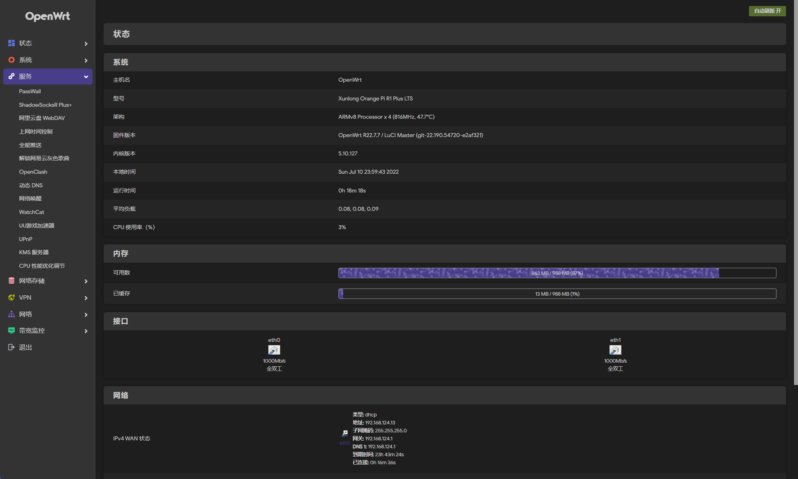
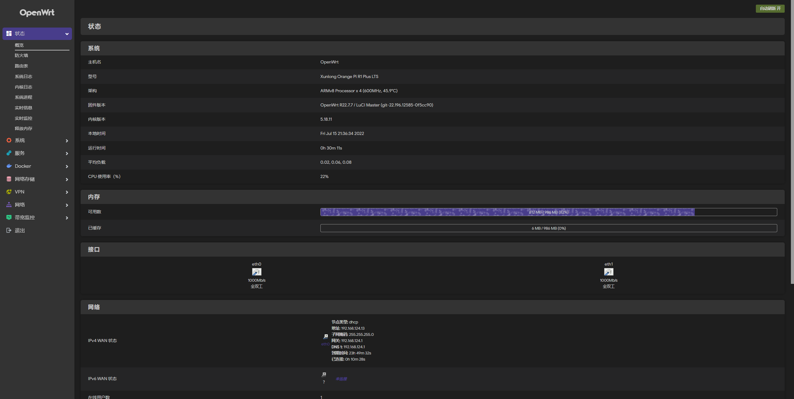
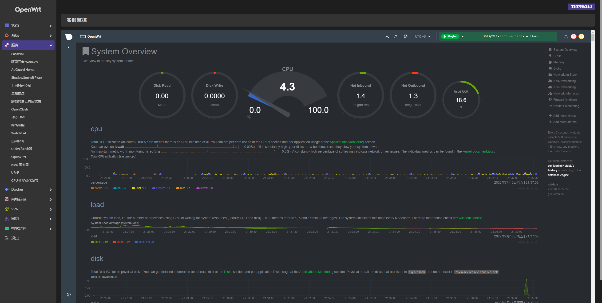

# OrangePi R1 Plus LTS Lede云编译脚本

> 使用最新 Lede 源码( 5.15内核 WAN 口驱动未适配，5.10 正常 )

> Lede 5.18 内核已适配，可在 Actions 界面下载打包好的压缩包( 默认 Docker )

> 使用 immortalwrt 21.02 分支( 测试版 )

每日清晨自动编译，Releases 可下载最新镜像，后台: 192.168.8.1 密码: password。

### 5.10 演示

### 5.18 演示

