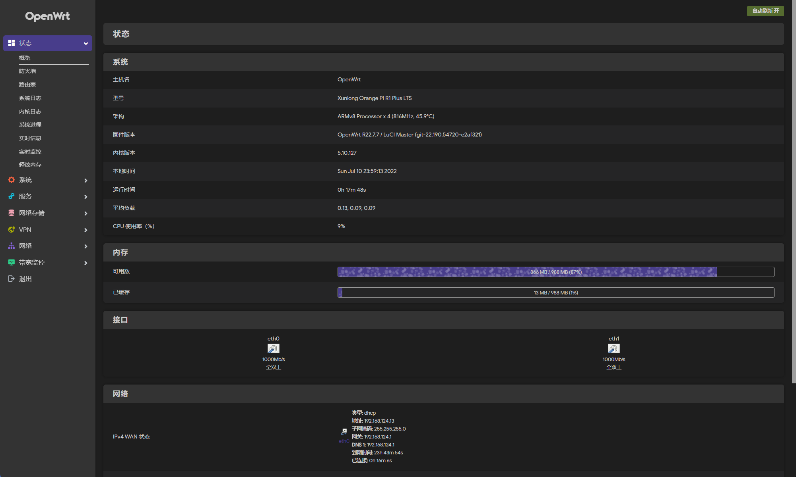

# OpenWRT 云编译脚本

> 采用 Lede 最新源码编译

> 每日清晨自动编译，Releases 可下载最新镜像

> OrangePi R1 Plus LTS (默认编译 5.18 版本)后台地址: 192.168.8.1 密码: password

> N1(默认编译最新 +o 版本) 后台地址: 192.168.43.1 密码: password

> 需要自定固件可以 Fork

### OrangePi 5.10 演示

### OrangePi 5.18 演示

